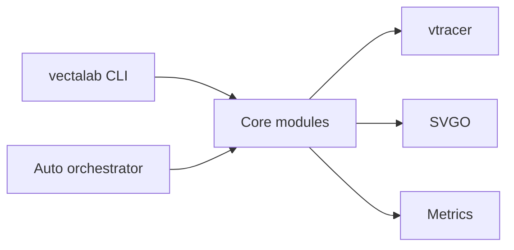
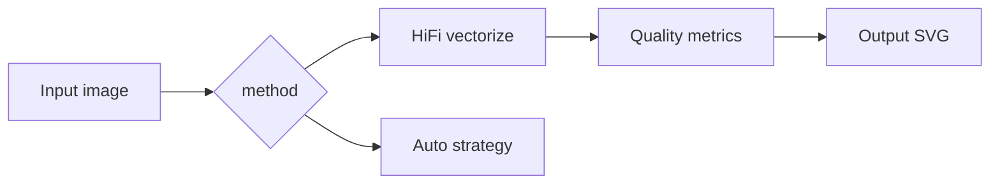
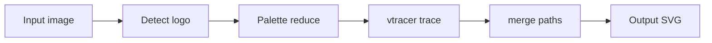
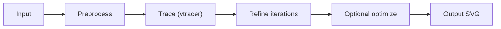
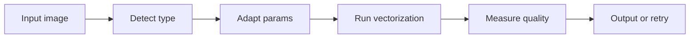
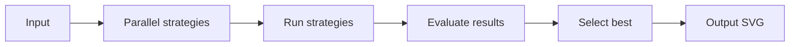

# Architecture & Conversion Pipelines — diagrams (Mermaid)

This document shows a compact, high-value visual overview of the Vectalab architecture and the main conversion pipelines. Diagrams are intentionally simple and use a pastel theme for clarity and readability.

---

---

## Per-pipeline diagrams — concise

Notes: each mini-diagram is annotated with the canonical handler/function from the codebase so maintainers can quickly find the implementation.

### Convert / HiFi pipeline

### Logo pipeline

### Premium (SOTA + 80/20) pipeline

### Smart pipeline (targets size/SSIM budget)

### Auto pipeline (parallel strategies)

---

### How to embed or render these diagrams
- GitHub renders Mermaid blocks in README.md and many Markdown viewers support Mermaid. The diagrams above are intentionally compact so they read well in-line.

---

If you'd like, I can also export individual diagrams to PNG/SVG assets, or split the per-pipeline diagrams into separate files for in-page embedding in `docs/assets/`.
